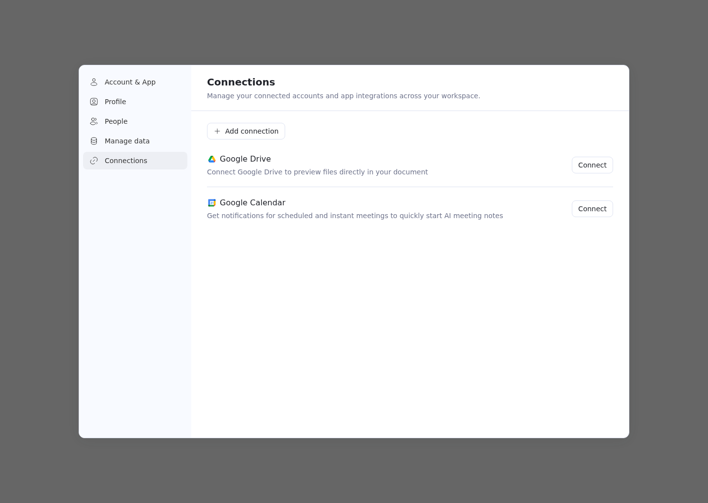
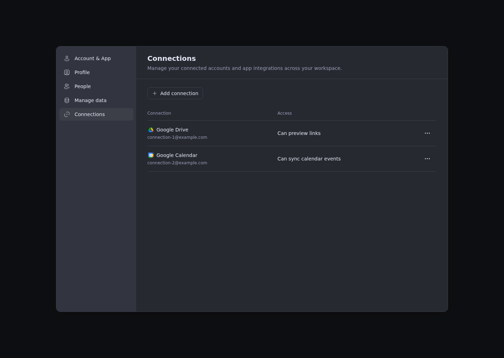

# Connections settings

Settings → Connections uses the same workspace-scoped integration API as desktop for Google Drive
and Google Calendar. It lists the current user's accounts, resolves email addresses through Cloud's
provider proxy, supports additional accounts, and asks for confirmation before disconnecting one.

The HTTP adapter is `src/application/services/js-services/http/integration-api.ts`. OAuth popup
handling lives in `src/application/integrations/oauth.ts`; the settings hook owns requests and
cancels them when the panel closes or the workspace changes. Provider credentials stay in Cloud.

## Cloud callback requirement

Deploy with the browser handoff in Cloud's
`libs/appflowy-cloud-integrations/assets/oauth_callback.html`. This template is embedded in the
Cloud binary, so changing the file requires rebuilding/deploying Cloud. Older callback pages only
open the desktop app and cannot finish web authorization.

Web opens a popup directly from the user's click, then navigates it to Cloud's `oauth_url`.
It sends `{type: 'appflowy:integration-oauth-request', state}` only to the origin in that URL's
`redirect_uri`. The callback page must verify `event.source === window.opener`, an HTTP(S) sender
origin, and the matching OAuth state before replying to `event.origin` with
`{type: 'appflowy:integration-oauth-callback', oauth_query}`. Never send authorization codes to `*`.

Web verifies the popup, origin, and state, then submits the query unchanged to the authenticated
`POST /api/integrations/connections/callback` API. Cloud validates its pending state binding and
exchanges the code. The popup listener accepts one callback, handles denial/closure, and times out
after two minutes. Cloud retains the desktop deep-link flow for desktop launches.

## Preview





## Verification

Run `pnpm type-check` and:

```sh
pnpm exec jest --runInBand --no-coverage src/application/integrations/__tests__/oauth.test.ts src/application/services/js-services/http/__tests__/integration-api.test.ts src/components/app/settings/__tests__/ConnectionsPanel.test.tsx src/components/app/settings/__tests__/Settings.workspaceImport.test.tsx src/components/app/settings/__tests__/Settings.connections.test.tsx
```

In Cloud, run `node --test libs/appflowy-cloud-integrations/tests/oauth_callback.test.cjs`.
Live Google authorization also requires the provider credentials and exact Cloud callback URI
to be configured on the deployed server.
