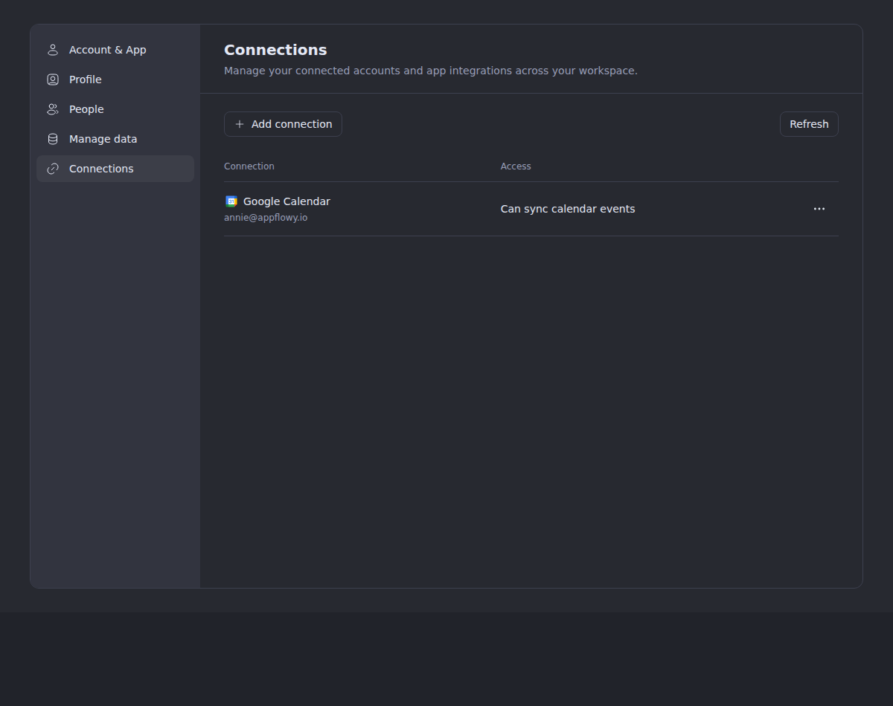
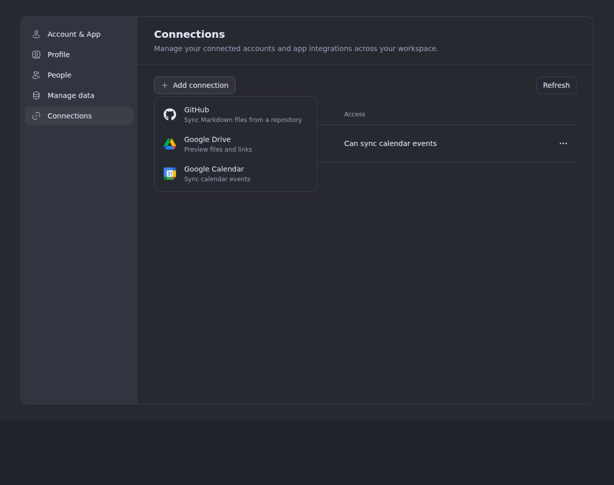
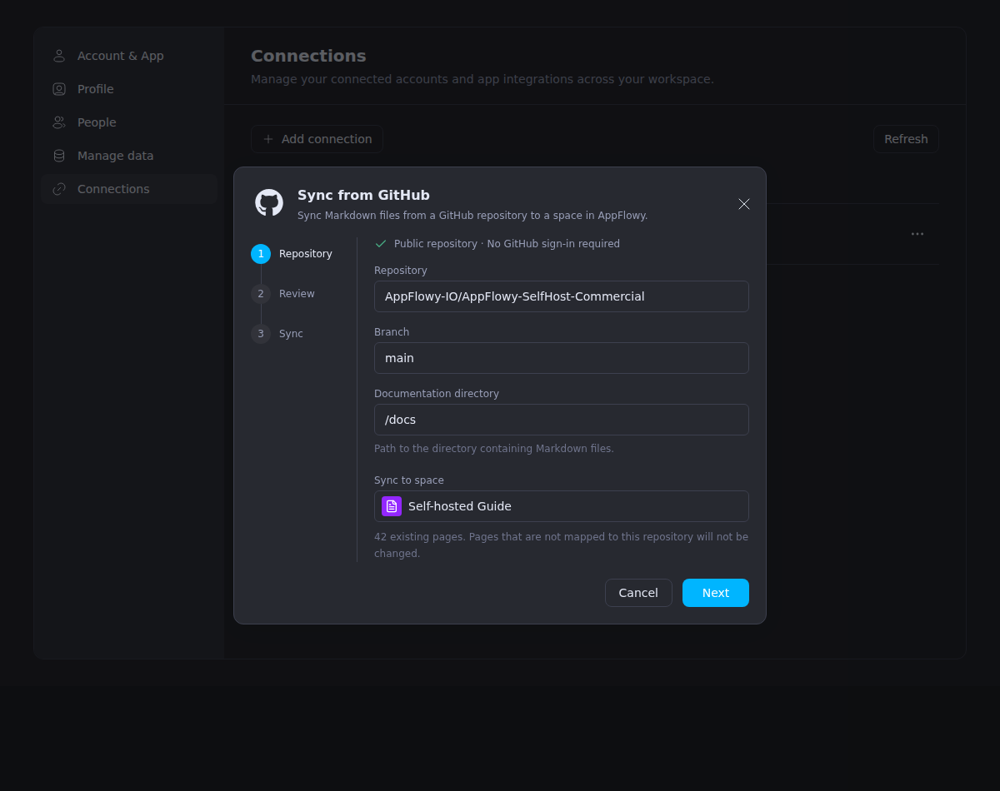
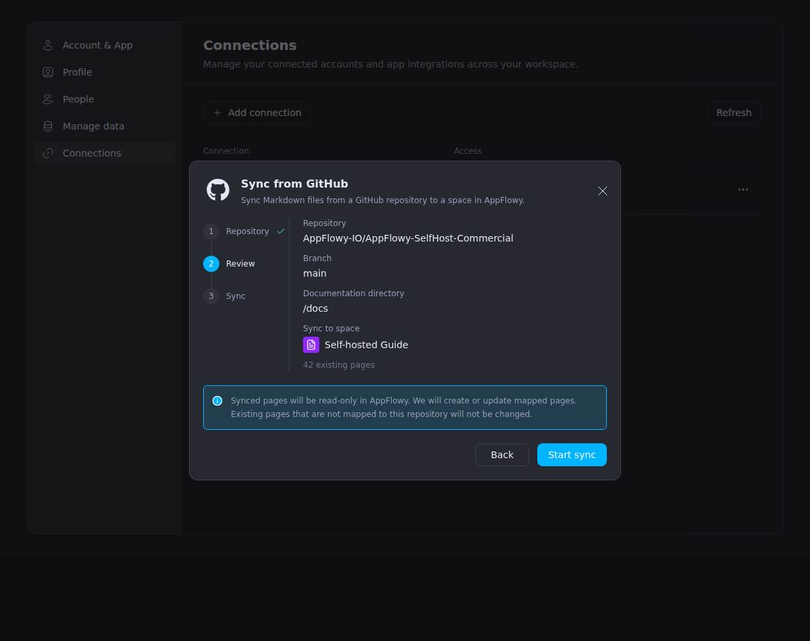
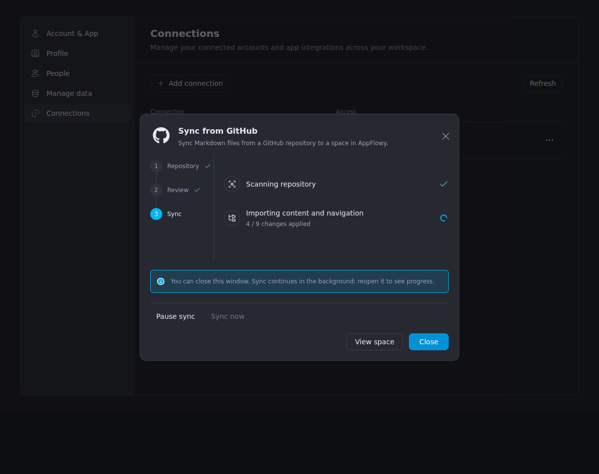
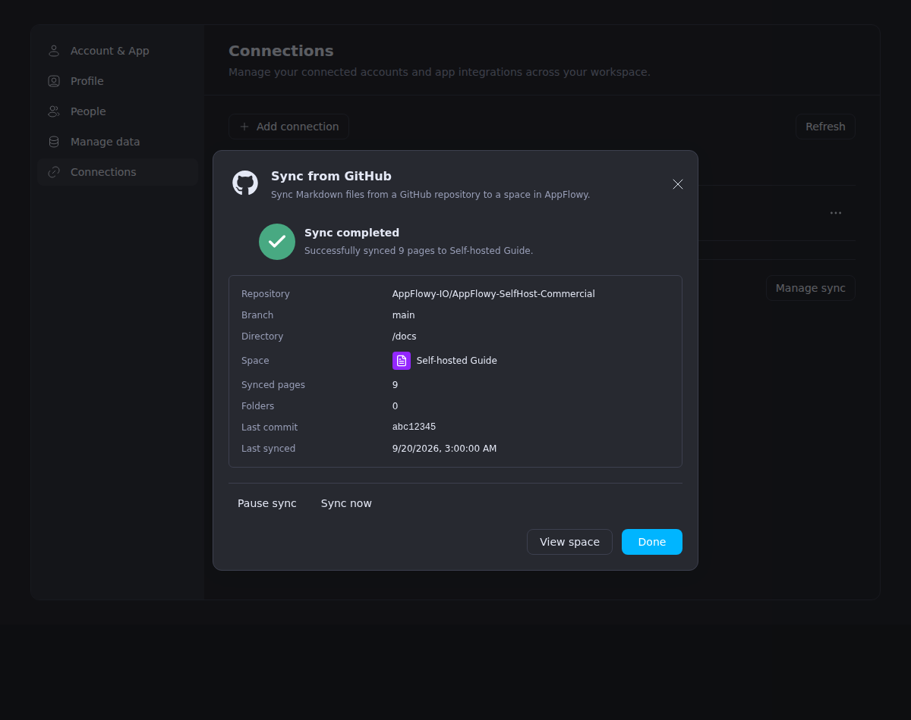
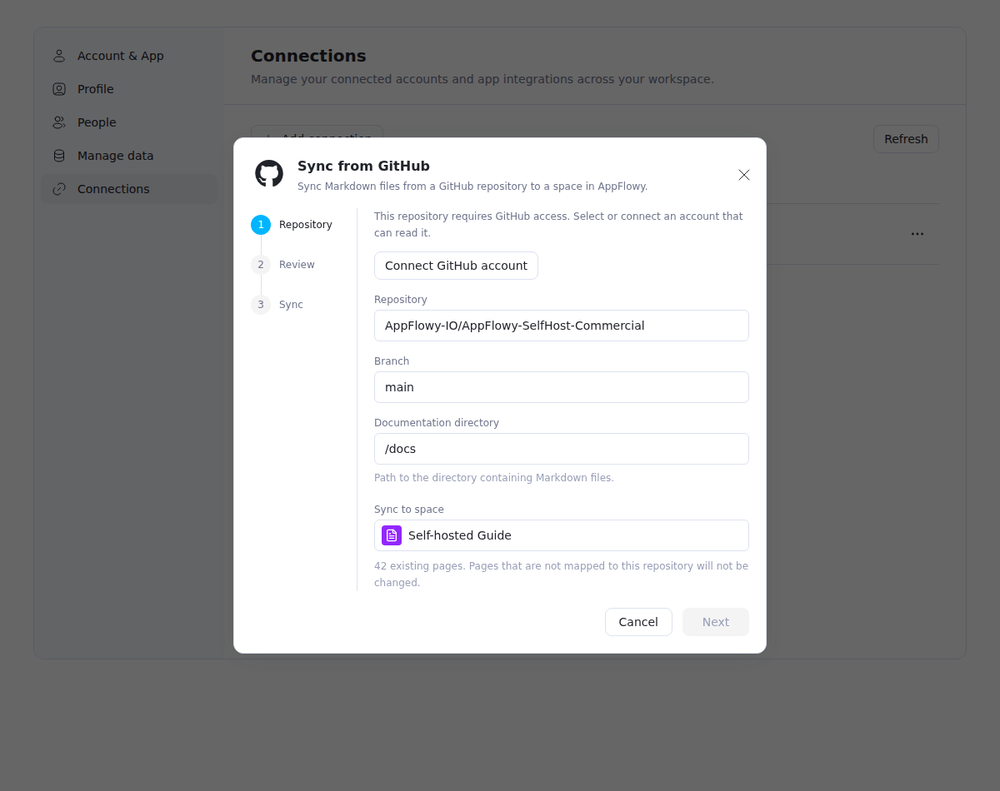
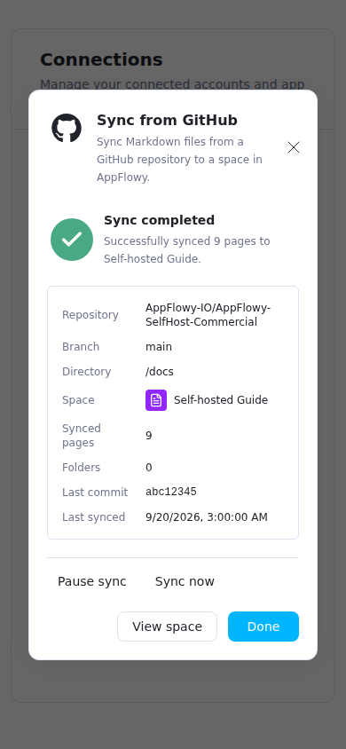

# Connections settings

Settings → Connections manages Google Drive/Calendar accounts and GitHub documentation sync.
Google accounts use the same workspace-scoped integration API as desktop, including email lookup
through Cloud's provider proxy, additional accounts, and confirmation before disconnecting.
GitHub setup checks public repository access first; public documentation requires no GitHub sign-in.

The HTTP adapter is `src/application/services/js-services/http/integration-api.ts`. OAuth popup
handling lives in `src/application/integrations/oauth.ts`; the settings hook owns requests and
cancels them when the panel closes or the workspace changes. Provider credentials stay in Cloud.

The panel reads the configured provider keys from `/api/server-info` alongside the account list.
Existing servers expose those keys only with `x-platform: app`; this request reads just `connections`,
without adopting native feature flags. Providers absent from that list cannot open an OAuth popup.
The panel explains their availability and always offers Refresh to update accounts and provider
configuration. Refresh retries failed account-email lookups while reusing successful results;
unavailable providers use stored account identifiers until they are enabled again.
Connection errors remain visible in Settings, including when popups are blocked or the network fails.

## GitHub documentation sync

**Add connection → GitHub** opens the repository/review/sync wizard. Cloud's workspace configuration
provides the allowed repository, `main` branch, `docs` directory, destination space, existing-page
count, and owner management capability. These fields describe the configured internal rollout;
the UI does not offer arbitrary repository or destination editing.

The layout follows the supplied six-screen design: Connections and its provider menu, a GitHub
header with a vertical numbered Repository/Review/Sync stepper, aligned configuration and review
fields, progress, and a green completion state with a bordered summary. Add connection is the
setup entry; a management section appears once a binding exists. The account field appears only
when repository access requires authentication. Completion uses actual synced page/folder counts
and last-sync time, with **View space** and **Done** actions.

The wizard probes repository access without credentials. Public access proceeds directly to review
and creates a binding without `connection_id`. Only an `authentication_required` response reveals
GitHub account selection and **Connect GitHub account**. That action reuses the generic OAuth popup
and authenticated confirmation below. GitHub labels come from `metadata.github_login` or
`metadata.account_name`; numeric `account_identifier` values are not emails, and GitHub never uses
Google's `getConnectionEmail` endpoint. A private repository requires configured GitHub OAuth.
Public sync availability is independent of OAuth provider configuration.

Review describes the fixed source/destination and read-only behavior. It does not fabricate a
source preview or create/update count. Unmapped existing pages remain untouched; explicit adoption
mappings are supported by the server API but have no mapping editor in this wizard. Starting sync
creates durable server work. The dialog shows actual operation progress and persisted page/folder
counts, retains partial failures, and can close/reopen without creating another import. It polls
serially every two seconds while work is active, every fifteen seconds while idle, and backs off
on errors using the server retry delay. Closing or switching workspaces cancels requests and
rejects stale responses.

Progress has two truthful stage rows: scanning the repository, then importing content and setting
up navigation. The server combines page creation, content import and hierarchy changes in its
operation count, so the UI does not invent the mockup's separate per-stage totals. The close note
explains that sync continues and can be reopened; it does not promise a completion notification.

Owners can use **Sync now**, pause/resume, or check access and reconnect. Pausing retains read-only
page ownership. Moving an OAuth binding to public access is explicit: verify anonymous repository
access, PATCH `authentication_mode: "public"` with the current generation, then resume using the
returned generation. Removing an OAuth account never silently converts its bindings to public
access. Source badges provide status, **Open in GitHub**, and GitHub history provenance; managed
page content and structural actions stay read-only, with history preview available and restore
blocked. The current UI does not publish public-site snapshots, detach ownership, or create PRs.

The full-page editor, page modal, metadata menus and history restore keep writes disabled while
the page-source check is pending or fails. A successful unmanaged response restores ordinary
page permissions. Only an explicit HTTP 404 from an older server falls back to canonical object
permissions; confirmed GitHub ownership remains read-only even then. This also covers cached
writable permissions, sidebar icons and the **Shared with me** rename/icon menu. Pending title
saves and image-picker callbacks also recheck editing access before issuing mutations.

Key implementation files:

- `src/application/integrations/github-sync.ts` and
  `src/application/services/js-services/http/github-sync-api.ts`: configuration, repository probe,
  binding management, source status, and history DTOs/requests.
- `src/components/app/settings/connections/github/`: setup, durable status polling and management.
- `src/components/app/github-sync/`: managed-page source state, badges and version provenance.

Cloud and Worker require their destination allowlist and both migrations
`20260919120000_github_space_sync.sql` and `20260920120000_github_sync_public_authentication.sql`.
The second migration distinguishes public bindings from OAuth bindings whose credential was
removed. Source write protection is always active; there is no global sync enablement flag.

## Local provider setup

The callback change does not configure a Google OAuth application. Cloud needs a Google client ID
and client secret for `google-drive` and/or `google-calendar`.

In AppFlowy Admin, open **Settings → Connections** (`/console/integrations` with the default base
path). Copy the callback URL into a Google Cloud Web application OAuth client's authorized redirect
URIs, enable the corresponding Google APIs, then configure each provider with the client ID and
secret. Keep **Enable connection** checked and save. Each provider needs an entry even when sharing
the same Google OAuth client. This configures connected accounts separately from Google sign-in.

The admin page saves credentials through `/api/admin/integrations/providers`; Cloud encrypts the
secret in its database. Leaving the secret blank when editing preserves it. Database entries
override file configuration, including disabled entries. Removing an entry restores any file
configuration; disable it instead to prevent new connections. This does not revoke existing grants
at Google. See the Admin project's `apps/super/docs/connections.md` for setup details.

Alternatively, use a private local copy of Cloud's `integrations-providers.example.json` and set
`INTEGRATIONS_PROVIDERS_FILE` to its path before starting Cloud. This file is optional when using
the admin page. Do not commit the populated file. The obsolete `NANGO_INTEGRATIONS_FILE` variable
does not configure the native integration engine.

Register the callback URI advertised by the admin provider API in the Google OAuth application.
With `APPFLOWY_BASE_URL=http://localhost:8000`, it is
`http://localhost:8000/api/integrations/connections/oauth/callback`.

`GET /api/server-info` with `x-platform: app` reports the configured keys in `data.connections`.
An empty array means no providers are available. File changes require restarting Cloud; admin
console changes are picked up by its provider cache (up to 30 seconds across replicas). Refresh the
Connections panel afterward.

## Cloud callback requirement

Deploy with the browser handoff in Cloud's
`libs/appflowy-cloud-integrations/assets/oauth_callback.html`. This template is embedded in the
Cloud binary, so changing the file requires rebuilding/deploying Cloud. Older callback pages only
open the desktop app and cannot finish web authorization.
Merging the Cloud PR alone does not update an already-running local binary.

Web opens a popup directly from the user's click, then navigates it to Cloud's `oauth_url`.
It sends `{type: 'appflowy:integration-oauth-request', state}` only to the origin in that URL's
`redirect_uri`. The callback page must verify `event.source === window.opener`, an HTTP(S) sender
origin, and the matching OAuth state before replying to `event.origin` with
`{type: 'appflowy:integration-oauth-callback', oauth_query}`. Never send authorization codes to `*`.

Web verifies the popup, origin, and state, then submits the query unchanged to the authenticated
`POST /api/integrations/connections/callback` API. Cloud validates its pending state binding and
exchanges the code. The popup listener accepts one callback, handles denial/closure, and times out
after two minutes. Cloud retains the desktop deep-link flow for desktop launches.

## Preview


GitHub setup with controlled repository fixtures:

















## Verification

Run `pnpm type-check` and the relevant suites:

```sh
pnpm exec jest --runInBand --no-coverage src/application/integrations/__tests__/oauth.test.ts src/application/services/js-services/http/__tests__/integration-api.test.ts src/components/app/settings/__tests__/ConnectionsPanel.test.tsx src/components/app/settings/__tests__/Settings.workspaceImport.test.tsx src/components/app/settings/__tests__/Settings.connections.test.tsx
```

The GitHub setup/management suite is
`src/components/app/settings/connections/github/__tests__/GitHubSyncDialog.test.tsx`; also run
`src/application/services/js-services/http/__tests__/github-sync-api.test.ts` and the page-source
suites in `src/components/app/github-sync/__tests__/`. These controlled tests exercise public/private
setup, credential isolation, durable reopen, pause/recovery, source permissions and request cleanup.
They do not by themselves establish live browser GitHub authorization or a deployed provider flow.

The 2026-09-20 focused checks passed 113 distinct tests: 84 integration, settings, GitHub API,
wizard and page-source cases, plus 29 permission regressions. The 33 wizard and Connections-panel
tests passed again after the screenshot-based layout changes; these are reruns, not additional
distinct tests. Type-checking, lint and the production build passed; the post-layout build took
19.58 seconds. The final type-check and 33-test rerun also cover the subsequent setup-card visibility
and Refresh dependency changes.

The read-only follow-up passed 103 focused tests across 17 suites, plus TypeScript and focused
ESLint checks. Regressions cover unresolved/failed ownership checks, full-page and modal editors,
paused/failed bindings, sidebar/shared-page metadata controls, history restore, undo/redo, and
delayed title/upload callbacks. Confirmed manual pages retain editing. These checks use controlled
component fixtures; the live GitHub BDD result below predates this follow-up and was not rerun.

The browser check rendered the real Settings menu, Connections panel and dialogs in Chromium
against controlled HTTP responses. It exercised public setup without OAuth, close/reopen and
completion, pause, private setup with the actual Cloud callback HTML and popup confirmation, and
a 390px viewport. The final browser run passed after those last UI changes and produced all eight
GitHub screenshots above. The screenshots show that fixture; provider consent itself was simulated.

In Cloud, run `node --test libs/appflowy-cloud-integrations/tests/oauth_callback.test.cjs`.
Live Google authorization also requires the provider credentials and exact Cloud callback URI
to be configured on the deployed server.

## Live GitHub BDD test

`playwright/bdd/features/integrations/github-sync.feature` drives the real Web application, Cloud,
Worker and object storage against `AppFlowy-IO/AppFlowy-SelfHost-Commercial/main/docs`. It does not
mock sync endpoints or GitHub responses. Use an explicitly provisioned test workspace with an
owner who can sign in by password and a **blank, unbound destination space**.

Run current Cloud and Worker binaries against the fully migrated application schema, including
both GitHub sync migrations listed above. Configure the same `APPFLOWY_GITHUB_SYNC_WORKSPACE_ID`
and `APPFLOWY_GITHUB_SYNC_SPACE_ID` in both processes, with
`APPFLOWY_GITHUB_SYNC_REPOSITORY=AppFlowy-IO/AppFlowy-SelfHost-Commercial`. Cloud and Worker must
share working PostgreSQL, Redis and S3-compatible storage; copied asset URLs must be reachable
by the browser/test runner. The Web application's configured API/auth URLs must point to that
deployment. Public GitHub reads need network access and available anonymous quota; this scenario
requires neither GitHub OAuth configuration nor a GitHub access token.

Set these variables in the test process's private environment:

| Variable | Value |
| --- | --- |
| `BASE_URL` | Running Web application URL. |
| `APPFLOWY_BASE_URL` | Cloud API base URL, without `/api`. |
| `APPFLOWY_GOTRUE_BASE_URL` | GoTrue base URL used by that Web deployment, including any proxy prefix. |
| `GITHUB_SYNC_E2E_OWNER_EMAIL` | Existing workspace owner's email. |
| `GITHUB_SYNC_E2E_OWNER_PASSWORD` | That owner's password; do not put it in committed configuration. |
| `GITHUB_SYNC_E2E_WORKSPACE_ID` | UUID matching Cloud and Worker's allowed workspace. |
| `GITHUB_SYNC_E2E_SPACE_ID` | UUID matching their allowed, blank destination space. |

```sh
pnpm test:e2e:bdd:github-sync
```

The dedicated `playwright.github-sync.bdd.config.ts` selects only this feature and its steps,
runs one Chromium worker, disables retries, and allows ten minutes. The default BDD configuration
excludes `@github-sync-live`, so a normal suite run does not start a live repository import.
Explicit execution with missing owner/destination variables fails with setup guidance; it does
not skip. Generation and `--list` remain usable without credentials.

The scenario signs in through the password UI, creates an unrelated manual sentinel through the
normal page API, then uses **Settings → Connections → Add connection → GitHub → Next → Start
sync**. It checks that public setup opens no OAuth popup and sends no connection ID, closes and
reopens the durable run, waits for completion, compares UI counts with actual binding entries,
and opens an imported document through **View space** to verify its source link and read-only
editor. Exactly one binding-creation request must occur. The sentinel's fresh Yjs content, parent,
name and unmanaged status must remain unchanged.

`playwright/support/github-sync-content-verifier.ts` independently fetches the complete Git tree
at the applied commit and its pinned raw Markdown/assets, verifies Git object hashes, decodes
fresh authenticated page-view Yjs responses, and compares ordered Markdown semantics, formatting,
links, heading targets and copied image bytes. It does not use the production converter to build
expected documents. The `github-source-verification` JSON attachment records the commit, imported
paths/view IDs, page/folder counts and verified block/image counts. The HTML report is written to
`playwright-report/github-sync`; failure traces/screenshots go to `test-results/github-sync`.

Once the creation response confirms the new binding's ID, cleanup pauses that binding after the
scenario, including a later assertion failure, to stop periodic GitHub requests. It preserves
imported documents and the manual sentinel for inspection. If Cloud commits creation but the
browser loses its response, the result requires inspection: cleanup does not infer ownership of
other newly observed bindings. A second initial-import run needs a fresh blank space and matching
Cloud/Worker configuration; the test does not delete or silently reuse an earlier import.

On **2026-09-20**, the dedicated live BDD scenario passed **1/1 in 3.7 minutes** against real Web,
Cloud, Worker, GoTrue, S3-compatible storage and public GitHub. An actual anonymous rate limit
delayed the import; Worker automatically retried the same durable run and completed at
03:47:51 UTC. The browser completed setup without GitHub OAuth, closed/reopened the run, verified
the imported document's source/read-only state, and preserved the unrelated manual page. The
After hook confirmed `enabled: false` on the newly created binding while retaining its content.

The `github-source-verification` attachment records commit
`da5f03250512a7effc1139ab2be235cda63f8171`: **9 pages, 0 folders, 1,748 blocks and 38 images**.
The imported source files were `docs/AUDIT.md`, `docs/AUTHENTICATION.md`, `docs/docker-compose.md`,
`docs/LDAP.md`, `docs/LICENSE_INVITE_CODE.md`, `docs/MODEL_CONFIG.md`, `docs/OIDC.md`,
`docs/OKTA_SAML.md` and `docs/SCIM.md`. The independent verifier checked the complete pinned tree
inventory, source hashes, persisted page placement and document semantics, and copied image
bytes. This corpus has no nested source folders, so this live run does not exercise folder creation.

The oracle's **21 focused unit tests** also passed, including intentional content, formatting,
ordering, link/image and topology corruption. Those unit results and the earlier controlled
browser screenshots remain separate from this live end-to-end result.
