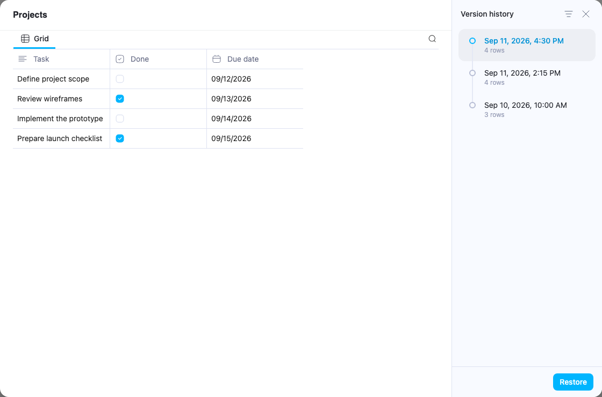

# Database version history

Database pages expose **Version history** when the server advertises database-history support
and the user can write to the database. Linked views use the same database history. The dialog
shares its presentation with document history, lists saved dates and row counts, and preserves
custom version names. Generated `Database snapshot` and `Before restore` names are hidden.

## Preview boundary

`DatabaseHistoryModal` loads metadata through `GET /history`, then loads the selected root and
all row pages through `GET /history/{version}/preview` and `/preview/rows`. These routes are
under `/api/workspace/{workspace_id}/database/{database_id}`. The selected version is rendered
only after its complete row payload has been validated.

`DatabaseHistoryPreview` owns an isolated, immutable Yjs session. It mounts the existing Grid,
Board, Calendar, Chart, List, Gallery, Feed, and Form layouts without the live database loader,
websocket subscriptions, or persisted row seeds. View switching and row-property inspection
remain available; edits and live-data fallbacks are disabled. Its scroll viewport and calendar
overlays are independent of the page behind the dialog.

Database history includes the root, saved views, fields, and row properties. Row-page document
content has its own document history. Historical previews therefore do not load current row
documents or current cross-database relation/rollup data.

## Restore boundary

Restoration enqueues a durable `/history/{version}/restore-jobs` job with an idempotency key and
`require_checkpoint: true`. Closing history stops polling but preserves the pending job; reopening
resumes it. Success requires a recovery version and a completed live database reload before the
dialog closes. The recovery snapshot remains selectable in history.

The committed restore job UUID identifies the database generation. HTTP and websocket updates,
outbox records, and row seed writes retain the generation under which they were authored. Restore
reconciliation fences old asynchronous responses, retires obsolete providers and database/row
outbox updates, and reloads the aggregate. Repeated notifications for the same generation preserve
current providers and queued edits. Row-page documents retain their independent state.

Sidebar membership belongs to Folder, separately from database view definitions. The server
reconciles verified mounts during restore and remembers entries removed by that restore so later
versions can remount them under their original active parent. Never-mounted views and ordinary
user deletions stay absent. After the restored aggregate reloads, initiating and follower tabs
refresh the current workspace's sidebar roots and expanded branches; revision fences prevent
older in-flight loads from bringing removed entries back.

## Validation

Tests cover the history API and pagination, all eight layouts, immutable previews, real grid
virtualization, restore polling, and generation-aware cache/outbox behavior. Database and document
history component tests live under their respective `src/components/*/history/__tests__` folders;
restore synchronization tests are in `src/components/ws/sync/__tests__`.

Browser checks with synthetic data cover short and long Grid snapshots, scrolling to the final
List/Gallery rows, sticky headers, and all eight layouts. The screenshot uses synthetic data.
