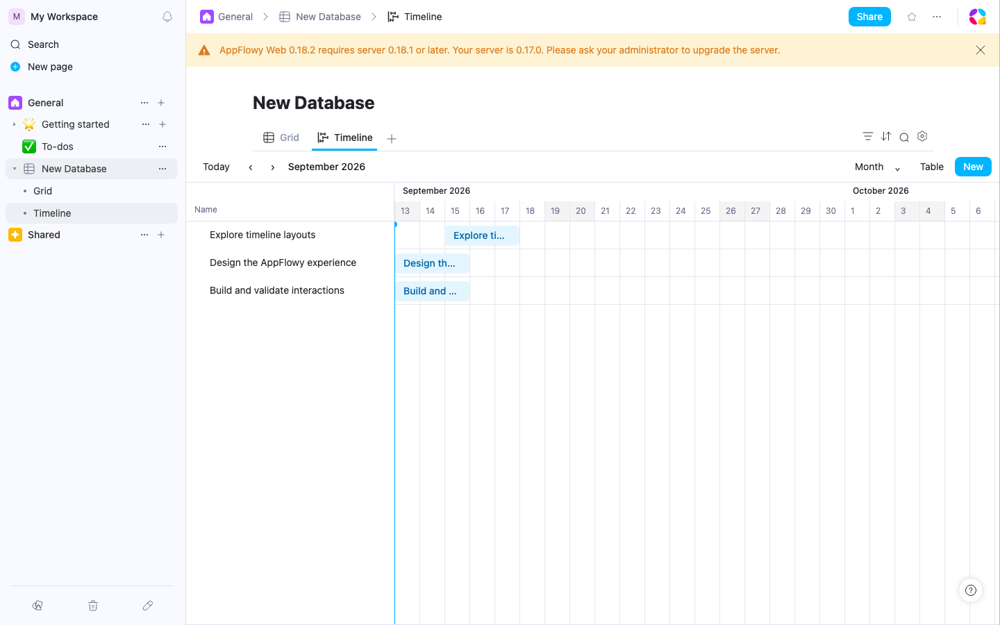
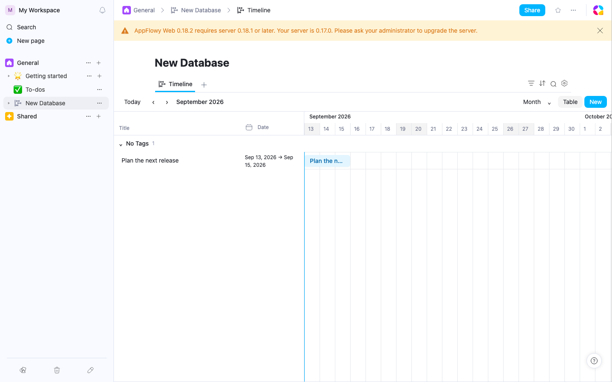
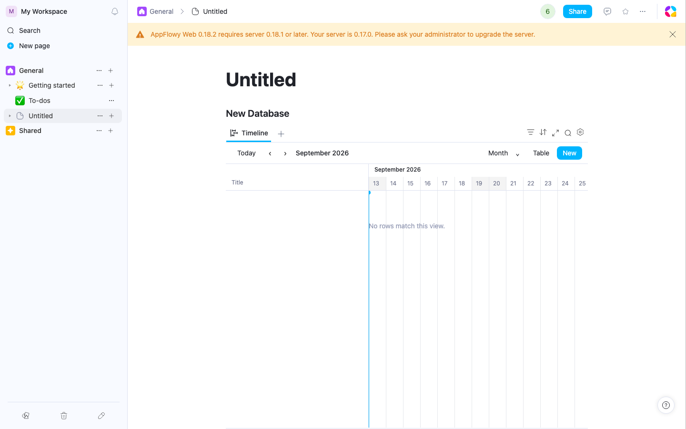

# Timeline interaction test design

The Timeline is a native AppFlowy database view. Each bar represents an existing
database row. Tests must establish that UI actions change the correct date cells
and retain row identity, rather than merely checking where a rectangle is drawn.

The executable acceptance specifications are:

- [Scheduling and interaction](features/database/timeline-interactions.feature)
- [Creation and read-only interaction](features/database/timeline-entry-readonly.feature)
- [Step definitions](steps/timeline.steps.ts)
- [Date assertions and pointer helpers](../support/timeline-test-helpers.ts)

Run against the local Web app and a Timeline-capable local server:

```sh
pnpm test:e2e:bdd:timeline --workers=2
```

To narrow a run, append `--grep @drag`, `--grep @resize`, `--grep @readonly`, or
`--grep @collaboration`. Run with `--trace=on` when investigating a failure.
Generated JavaScript under `.features-gen` is build output, not source to edit.

## Fixtures and independent assertions

Each scenario signs into a disposable local test account. Alpha has a three-day
inclusive all-day range, Beta has a different range, and Gamma has no dates.
Their stable row IDs, date cells, and a reminder are recorded before interaction.
The date fixture is relative to today so it remains visible on later test runs.
The browser's calendar arithmetic supplies expected dates; tests do not import
the production snapping or geometry functions as their oracle.

Direct collab writes are restricted to fixture setup and explicit external
schema-change fixtures. User actions use the mounted UI. Dragging uses actual
mouse down, intermediate moves, and mouse up, because HTML `dragTo` does not
exercise the bar's pointer capture, snapping, resize handles, or auto-scroll.
The pointer-cancel case injects the OS cancellation event after a real drag;
Playwright cannot synthesize a physical device disconnect.

For a moved range, assert all of these:

1. The expected row's start and end dates changed by the same calendar offset.
2. Its inclusive duration, time flag, reminder, and identity are preserved.
3. Other rows' dates are byte-for-byte equivalent after normalization.
4. A single undo restores both endpoints; a single redo reapplies both.
5. A fresh page render after reload restores the dates and native layout.
6. A second mounted tab observes the same dates in collaboration scenarios.

Reload checks include the browser's local persistence. Two tabs in one browser
context also share IndexedDB/BroadcastChannel; they do **not** prove isolated
device delivery or durable server snapshots. Those require the separate-session
release test described below.

## Interaction coverage

“BDD” below means an executable browser scenario is present, not a claim that a
run has passed. The validation results at the end record actual execution.

| Surface | Acceptance criteria | Coverage |
| --- | --- | --- |
| Entry points | Standalone sidebar creation, linked view tab creation, inline slash insertion; native layout 8 and date field; reopen | BDD |
| Move bar | Forward/backward; equal shift of both dates; duration/reminder/other rows preserved; no accidental row modal | BDD |
| Resize start | Extend earlier, shorten later, clamp at end date | BDD |
| Resize end | Extend later, shorten earlier, clamp at start date | BDD |
| Single date | Move keeps end absent and range flag false | BDD |
| Timed range | Hour scale snaps a non-aligned pointer movement to fifteen minutes; time flag stays true | BDD |
| Cancel | Escape and pointer cancellation discard preview without creating undo history or opening the row | BDD |
| Edge auto-scroll | Hold at viewport edge; scrolling contributes to committed calendar offset; inclusive duration retained | BDD, right edge |
| Keyboard | Alt+Left/Right moves; Alt+Shift+Right resizes end; focused start/end handles accept arrows | BDD |
| Open row | Bar and table title open the same row; title edit updates the bar without changing dates | BDD |
| No-date list | Search, schedule existing row, remove from list, undo/redo | BDD |
| Empty track | Double-click a calendar column schedules that row on the selected date | BDD |
| New row | New opens row details, creates one row with a three-day inclusive date range, survives reload | BDD |
| Table row drag | Reorder by title handle; stable IDs and date values; order survives reload | BDD |
| Zoom/navigation | Hours/day/week/two weeks/month/quarter/year; previous/next/Today; today marker visible; date values unchanged | BDD |
| Table visibility | Hide/show persists and retains bar properties | BDD |
| Table width | Pointer resize persists; accessible separator exposes current width | BDD; keyboard/clamps in release matrix |
| Properties | Table and bar fields selected independently; rendered values agree with cells; settings survive reload | BDD |
| Grouping | Group membership/counts, collapse/reopen, no manual row reorder while grouped | BDD |
| Search | Matching rows only; clear restores rows and original dates | BDD |
| Filter and sort | Apply/remove a Name filter; sort descending; correct visual order with manual reorder disabled | BDD |
| Offscreen ranges | Both earlier and later ranges jump into the calendar without editing their dates | BDD |
| Invalid ranges | Show an invalid-range message, omit the bar and scheduling action, preserve the original cells | BDD |
| Separate date fields | Start and Finish selected through settings; both fields move/undo/redo in one action and persist | BDD |
| Generated dates | Created time renders but has no scheduling handles; pointer and keyboard cannot mutate dates | BDD |
| Deleted date field | Recoverable empty state; add replacement date field; existing rows remain | BDD |
| Read-only | Locked document passes real read-only context; no create/settings/resize/reorder; drag and keyboard cannot write; navigation/zoom/group expansion remain local | BDD |
| Collaboration | Two mounted tabs exchange pointer/keyboard edits; stale drop rejects concurrent edit rather than overwriting it | BDD, shared browser context |
| Virtualization | 1,000 input rows mount fewer than 35 rows; vertical scroll changes the window; fixed row alignment | Component test |
| Time zones and DST | Spring/fall boundary; calendar-day width; inclusive all-day end; repeated timed hour; epoch and malformed timestamps | Geometry/row tests |
| Native persistence | Distinct folder layout 10 and database layout 8, date dependencies, settings map key 8 | Rust tests |

## Remaining release matrix

These are explicitly designed additional cases; do not count them as passing
automation until their browser/device runs are recorded. This matrix also
defines the acceptance criteria for future extensions to the suite.

| Case | Given / When / Then |
| --- | --- |
| Drag across month/year | Given Dec 30–Jan 2, when moved two days, then Jan 1–4 with the same inclusive duration and undo restoring the original year boundary. |
| Drag during DST | Given dates spanning the spring or fall clock change in America/New_York, when moved one calendar day, then local dates advance once with no one-hour drift. Repeat in UTC and Asia/Shanghai. |
| Left edge auto-scroll | Given a visible bar, when held beside the table boundary, then earlier dates scroll into view and dropping includes that scroll offset. |
| Outside drop and lost capture | Given a captured gesture, when released outside the bar or viewport, then one commit occurs; when capture is cancelled by the browser, no commit occurs and no ghost preview remains. |
| Touch/pen | Given a touch or pen pointer, when moving/resizing a bar, then horizontal scheduling works while vertical page scrolling remains usable; cancel restores the range. |
| Zero displacement | Given a bar, when dragged less than the gesture threshold, then opening the row creates no date/history update. Moving less than half a snap unit must not change dates. |
| Remote row removal/field switch | Given an active preview, when the row disappears or selected date field/scale changes, then capture and preview are cancelled without writing into another row/field. |
| Malformed/inverted dates | Given an end before start, when rendered or clicked, then show an invalid-range state and allow repair in row details; no silent endpoint swap or destructive default scheduling. |
| Mixed time metadata | Given separate start/end properties with differing time flags, when editing one endpoint, then preserve each property's precision and time zone. A row unit test covers independent time flags/reminders; mixed-precision visual behavior still needs browser validation. |
| Blank separate endpoint | Given a start but empty Finish, when moved, then keep Finish empty; when resized, then create only the requested endpoint. |
| Table cell edit | Given Date visible in the table, when its date picker changes start/end/time or clears the date, then the bar and no-date count immediately agree; undo/redo restores both representations. |
| Offscreen row variants | The basic left/right jump is automated. Repeat with the table hidden and a partially clipped long range; jumping must not change the range. |
| Long-range label | Given a bar crossing the left viewport edge, when panning, then the title stays readable and does not overlap the sticky table. |
| Buffered scrolling | Given repeated horizontal scrolling in either direction, when the canvas recenters its finite buffer, then displayed dates stay continuous with no bar jump. |
| Large database | Given 1,000/10,000 real rows, when vertically scrolling to distant rows then dragging one, verify stable row identity, table/bar y alignment, bounded DOM size, and loaded live row data. |
| Width accessibility | Given the column separator focused, when Left/Right is pressed or dragged past bounds, then width clamps to 180–640, persists, and aria-valuenow agrees. Cancelled pointer resize restores width. |
| Group visibility | Given populated and empty groups, when individual/all visibility or hide-empty changes, then correct groups appear and settings persist. Collapse does not alter dates. |
| Advanced filters | Basic Name filtering/removal is automated. Add nested AND/OR filters and verify that a date edit crossing a filter boundary updates membership and no-date results. |
| Sort variants | Name descending and disabled reorder handles are automated. Add date/multi-property sorts and verify clearing sorts restores manual ordering. |
| View switching | Given linked Grid/Calendar/Timeline views, when a Timeline edit is made and views switch, then all representations read the same date cells; Timeline settings remain view-specific. |
| Empty/loading/errors | Given zero rows, no matching rows, delayed row collabs, deleted fields, or a failed commit, then render a stable empty/loading/error state without creating duplicate rows. |
| Permissions | Repeat editing with a server-enforced viewer and a published view; mutation APIs must reject writes, not merely hide controls. Document locking is the current mounted UI check. |
| Isolated sessions | Given independently authenticated browser contexts without shared browser storage, when a date is edited, then another session receives it via the server. Await durable server snapshot and reopen in a clean third context. |
| Concurrent unrelated edit | Given dragging Alpha, when another session edits its title/reminder, then preserve that update while committing dates; concurrent date changes must reject the stale gesture. |
| Themes/accessibility | Light/dark, keyboard-only focus, screen-reader labels/live announcement, narrow width, 200% zoom; bar text, handles, today line and group boundaries remain distinguishable. |

Dependency arrows, automatic dependent-task shifting, nested sub-item rendering,
conditional bar colors, and footer calculations are outside this implementation.
They need their own specifications if adopted; existing scenarios should not
claim Notion's full feature parity.

## Feature preview and server dependency

Timeline creation requires the companion [server PR #1161](https://github.com/AppFlowy-IO/AppFlowy-Cloud-Premium/pull/1161),
which adds Folder/API layout `10` and database layout `8`. A server without that
support rejects creation with HTTP 400.

These screenshots show the real local AppFlowy app in Chromium on September 13,
2026, after interaction and reload. The local server's older version string
causes the existing compatibility banner shown in the captures.







## Validation results

Validated on September 12, 2026 in Chromium against the local AppFlowy app:

- **40 distinct BDD scenarios passed across the full run and targeted reruns.**
  The initial full run passed 36/40. The four failures covered missing search/sort
  integration and server/worker readiness during fixture creation/locking. After
  fixing the integration and using matching local binaries, all seven selected
  rerun scenarios passed, including every previously failing scenario and the
  property/grouping regression checks. This is not a claim of one uninterrupted
  40/40 run.
- **39 Jest tests passed in five suites**: 24 Timeline geometry, settings, row,
  and canvas tests plus 15 existing database-toolbar tests. Timeline date tests
  ran with `TZ=America/New_York`.
- The Web TypeScript build check passed: `pnpm exec tsc --noEmit -p tsconfig.web.json`.
- Focused source and BDD lint checks passed. BDD files require a temporary lint
  project because the repository's default ESLint TypeScript project excludes
  `playwright/`.
- The two native Rust Timeline enum/dependency tests and local service build
  passed during implementation.
- Three UI smoke scenarios passed for linked, standalone/grouped, and inline
  Timeline creation. Their screenshots are embedded in the implementation
  report. Visual review also corrected the empty-state label's placement.

The initial verification app ran on port 18001 with its API on 18000 and matching
worker on 14001, built from a separate `AppFlowy-Cloud-Preminum` checkout. Those
results did not validate the server serving the user's app on ports 3000/8000.
On September 13, the default server reproduced a 400 for the linked Timeline
request: `Json deserialize error: invalid value: 10, expected one of: 0, 1, 2, 3,
4, 5, 6, 7, 8, 9`. The backend change was then ported into the requested repository
as worktree `~/Documents/AF/AppFlowy-Cloud-Premium-timeline`, branch
`codex/timeline-native-server`, based on `5377d9890`.
Both the API and worker must understand native Timeline layout values. The local
API retained the normal `just restart-server` missing-update preflight flag.
The app's existing Web/server version warning remained visible during tests.

The remaining release matrix above is designed but not claimed as executed.


### Corrected local server validation — September 13, 2026

The normal app (`http://localhost:3000`) and API (`http://localhost:8000`) now run
with the backend worktree above. Cloud, Worker, Search, and MCP were built together
and all four readiness checks passed. Runtime executable paths and working
directories were checked against `AppFlowy-Cloud-Premium-timeline`.

- The new response assertion failed against the original server with HTTP 400
  and the exact unknown-layout error, then passed against the rebuilt server with
  HTTP 200 and AppFlowy response code `0`.
- **3/3 creation smoke tests passed in one run**: linked, standalone/grouped,
  and inline Timeline. The linked test also exercises scheduling, drag, resize,
  cancellation, undo, and reopening. Screenshots in the implementation report
  were refreshed from this run.
- **12/12 selected BDD cases passed in one run**: movement in both directions;
  six start/end resize and clamping examples; separate start/end fields;
  locked-view protection; synchronization to another mounted view; and rejection
  of a stale drop after a collaborator edits dates.
- **7 focused Rust tests passed**: Timeline request deserialization for both API
  creation routes; distinct folder/database wire values; Timeline date-field and
  layout-setting initialization; the queryable-layout classification guard;
  existing Calendar dependencies; and the two existing Form wire-value checks.
  All four services also built successfully from this worktree. The changed Rust
  files add no formatter differences relative to their base; existing formatting
  differences in those files were left outside this fix.
- Temporary browser diagnostic logging was removed. The Playwright creation test
  retains a permanent API-response assertion to expose this compatibility error
  immediately in future runs.

Reproduce these browser checks after starting the server from its worktree:

```bash
BASE_URL=http://localhost:3000 APPFLOWY_BASE_URL=http://localhost:8000 \
APPFLOWY_WS_BASE_URL=ws://localhost:8000/ws/v2 \
pnpm exec playwright test -c playwright.config.ts \
  playwright/e2e/database/timeline-view.spec.ts --workers=1

pnpm exec bddgen test -c playwright.bdd.config.ts
BASE_URL=http://localhost:3000 APPFLOWY_BASE_URL=http://localhost:8000 \
APPFLOWY_WS_BASE_URL=ws://localhost:8000/ws/v2 \
pnpm exec playwright test -c playwright.bdd.config.ts \
  playwright/.features-gen/playwright/bdd/features/database/timeline \
  --grep 'Moving a bar preserves|Resizing one endpoint|A locked Timeline|Separate start and end fields|Date edits synchronize|A stale drop' \
  --workers=2
```

This corrective run covers these 15 browser tests, not a fresh run of all 40 BDD
scenarios or the unexecuted release matrix.
